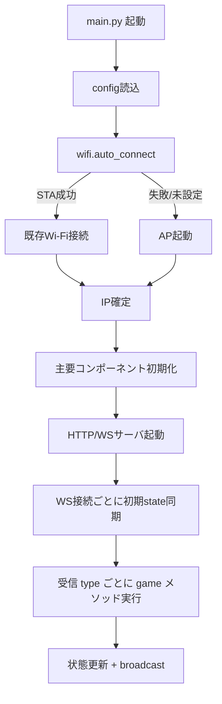

# 早押しボタン 管理画面マニュアル

教室やイベントで司会者が操作するための利用者マニュアルです。

---

## 1. 管理画面を開く

1. 本体（早押しボタン装置）の電源を入れる
2. Wi-Fi に接続できると、本体の LED 等で IP アドレスが分かります
   - Discord 通知が設定されていればそこに表示されます
   - 接続できなかった場合は本体が「HayaoshiButton」というアクセスポイントモードになるので、そこに繋いで `192.168.4.1` にアクセス
3. ブラウザで `http://<IPアドレス>/admin` を開く

表示画面（プロジェクター用）は `http://<IPアドレス>/` で開けます。

---

## 2. 画面の見方

```
┌────────────────────────────────────────────────────┐
│ 状態: [JUDGING]  問題: 3問目   正解残り: 2/3       │ ← 状態バー
├────────────────────────────────────────────────────┤
│ [JINGLE] [COUNTDOWN] [ARM] [STOP] [RESET]         │ ← 操作ボタン
│             [正解] [不正解]                        │ ← 判定ボタン
├────────────────────────────────────────────────────┤
│ 押下順序:  1位 Player 1  2位 Player 3 (+0.5秒)    │ ← 押下順
├────────────────────────────────────────────────────┤
│ # 色 名前      スコア  状態                        │
│ 1 🔴 Player 1  [-] 10 [+]  回答中                  │ ← プレイヤー表
│ 2 🟢 Player 2  [-]  0 [+]  -                       │
│ 3 ⚪ Player 3  [-]  5 [+]  2番目                   │
│ 4 🔵 Player 4  [-]  0 [+]  -                       │
└────────────────────────────────────────────────────┘
```

### 状態バーの意味

| 表示 | 意味 |
|------|------|
| IDLE | 待機中。ボタンを押しても反応しません |
| ARMED | 受付開始中。プレイヤーが押せます |
| JUDGING | 誰かが押して回答中。後続者もキューに入れます |
| RESULT | 結果表示中。次の問題の準備待ち |

右側の「**正解残り N/M**」は複数正解モード時だけ表示されます。

---

## 3. 基本の流れ（通常の早押しクイズ）

1. **ARM** をクリック → 受付開始（問題番号が +1）
2. プレイヤーが物理ボタンを押す → ランプ100%点灯（回答者）
3. **正解** or **不正解** をクリックして判定
   - 正解 → スコア加算、問題終了
   - 不正解 → スコア減算、3秒後に次の押下者へ
4. 次の問題へ進むには **ARM** をもう一度押す（STOP は不要）

ジングルや10秒カウントダウンを鳴らしたいときは **JINGLE** / **COUNTDOWN** を使ってください。

---

## 4. ボタンの機能一覧

### 操作ボタン

| ボタン | 動作 | いつ使う |
|--------|------|----------|
| **JINGLE** | 出題BGMを鳴らす | 問題を読み上げる前に |
| **COUNTDOWN** | 10秒カウントダウン開始 | 考える時間を区切りたいとき |
| **ARM** | 受付開始。問題番号が +1 される | 新しい問題を始めるとき |
| **STOP** | 受付停止 (IDLE状態) | ゲーム全体を一時終了するとき |
| **RESET** | リセットダイアログを開く | ペナルティ解除・スコア調整など |

### 判定ボタン

| ボタン | 動作 |
|--------|------|
| **正解** | 現在の回答者を正解扱い |
| **不正解** | 現在の回答者を不正解扱い。3秒後に次の人へ |

判定ボタンは連打防止のため、押した後0.5秒は反応しません。

---

## 5. プレイヤー管理

- **名前**: 欄をクリックして直接編集
- **色**: カラーピッカーで変更（プレイヤーのランプ色ではなく画面の表示色）
- **スコア**: `[-]` `[+]` で ±1 ずつ手動調整
- **状態欄**: 現在の状況が見えます（回答中 / 2番目 / 1問休み 等）

### プレイヤー人数を変える

設定欄の「プレイヤー人数」を 2〜8 から選択できます。**ラウンドの途中で変更するとスコアが飛ぶことがある** ので、できれば開始前に設定してください。

---

## 6. ゲームモード

### 通常の早押しモード（デフォルト）

設定で何も特殊なオプションを入れない場合、最初に押した人が正解を答えるまで続く一般的な早押しクイズです。

### 複数正解モード（一問多答）

「日本の都道府県を3つ答えて」など、**1つの問題に複数の正解**がある形式。

**使い方:**
1. 設定で「**複数正解モード（一問多答）**」にチェック
2. 「正解最大数」を入力（例: 3）
3. ARM → プレイヤーが押下・回答
4. 正解判定のたびに状態バーの「残りN/M」が減る
5. 最大数に到達するか STOP まで続く

**特徴:**
- 正解したプレイヤーは再び押せるようになる（同じ人が続けて複数答えてもOK）
- 不正解時は3秒待ちをスキップ（テンポが速い）
- 「正解最大数」をプレイヤー人数より多く設定することもできます

### 一括判定モード（書き問題）

「答えを紙に書いて」のような、全員が同時に答える書き問題形式。

**使い方:**
1. 設定で「**一括判定モード（書き問題用）**」にチェック
2. 必要なら「**着順ポイントを使用**」もチェックして、順位別の配点を調整
3. ARM → プレイヤーが答えを書き終わったら早押しボタンを押す（押さなくてもOK）
4. プレイヤーの答えを見て、**管理画面の各行のチェックボックスで判定を指定**:
   - 「**正**」チェック → 正解
   - 「**無**」チェック → 無回答として扱う
   - どちらもなし + 押下あり → 不正解
   - どちらもなし + 押下なし → 自動的に無回答
5. **正解** or **不正解** ボタンで確定（効果音が違うだけで、判定結果は同じ）

**着順ポイント使用時の配点:**
- 押下した正解者は着順に応じた点数（`10, 8, 6, 4, 3, 2, 1, 1` など配列で指定）
- 押してないけど正解マークした人は、押下者の次の順位として加点
- 不正解（押下あり）: `batch_incorrect` ポイント + ペナルティ
- 無回答: `batch_noanswer` ポイント（ペナルティなし）

---

## 7. 設定項目の説明

| 項目 | 意味 | デフォルト |
|------|------|-----------|
| プレイヤー人数 | 参加人数 (2〜8) | 8 |
| 正解ポイント | 正解時の加点 | 10 |
| 不正解ポイント | 不正解時の減点 | -5 |
| 不正解時 | 誤答者の扱い（4モード、下表） | 復活なし |
| 同時受付数 | 同時に押下受付する人数 (0=無制限) | 0 |
| ジングル再生時に自動で受付開始 | JINGLE押下と同時にARMする | OFF |
| カウントダウン終了時に自動で受付停止 | 10秒ゼロでSTOPする | OFF |
| 誤答時 | ペナルティ（N問休み） | なし |
| 複数正解モード | 一問多答モードを有効化 | OFF |
| 正解最大数 | 複数正解モードの上限 | 3 |
| 一括判定モード | 書き問題モードを有効化 | OFF |
| 着順ポイントを使用 | 一括モードで順位別配点を使う | ON |
| 着順ポイント | 順位別の配点 | 10,8,6,4,3,2,1,1 |
| 不正解 / 無回答 | 一括・着順モード時の誤答/無回答点 | -5 / 0 |

### 不正解時の復活モード

誤答者が再びボタンを押せるようになるタイミング:

| モード | 意味 | 使いどころ |
|--------|------|-----------|
| 復活なし | このラウンド中はもう押せない | シンプルな早押し |
| 即座に復活 | 誤答直後に押し直しOK | ラフな練習時 |
| 次の回答まで休み | 誰かが次に判定されたら復活 | 少しだけハンデを付けたい |
| 次の誤答まで休み | 次の誰かが誤答したら復活 | 誤答者同士でバトン |

### ペナルティ（N問休み）

誤答者を **N問分スキップ** させる設定。例: 「2問休み」にすると、誤答した人は次の2回分のARMの間ボタンを押せません。

---

## 8. リセットダイアログの使い分け

**RESET** ボタンを押すと出るダイアログ（物理リセットボタンでもトグル表示）:

| 項目 | 効果 | 使う場面 |
|------|------|----------|
| 受付停止のみ (IDLE) | 現在の受付だけ停止 | 問題を中止したいとき |
| ペナルティ一括解除 | 全員のN問休みをクリア | 誤ってペナルティを付けたとき |
| スコアリセット (全員0点) | 全員の得点を0に | 次のゲームを始めるとき |
| 問題番号 [-] [+] | 現在の問題番号を手動調整 | ARM や JINGLE を押し間違えたとき |
| 全リセット | スコア+ペナルティ+問題番号を全消し | セッション終了時 |
| キャンセル | 何もせず閉じる | 間違えて開いたとき |

---

## 9. 音声設定

画面右上の「音声:」で、どこから音を出すかを選べます（複数選択可）:

- ☐ 管理画面 — 司会者のPC/タブレットから
- ☐ 表示画面 — プロジェクター側のPCから
- ☐ DFPlayer — 装置に接続したスピーカーから

初回ロード時はブラウザが音声をブロックすることがあるので、画面のどこかをクリックして許可してください（🔇 → 🔊 表示に変わります）。

---

## 10. 音源管理

設定欄の下に「音源管理」があります。各効果音を差し替えたいとき:

1. 「対象」で差し替えたい音を選択（プレイヤー1〜8の押下音、正解/不正解/ジングル/カウントダウン等）
2. 「ファイルを選択」で MP3 ファイルを指定（**200KB以下**）
3. 「アップロード」で本体に保存

アップロードした音は次回起動時から有効になります。

---

## 11. 回答履歴

画面下部の「回答履歴」テーブルに、問題ごとの結果が記録されます。

| 記号 | 意味 |
|------|------|
| ○ | 正解 |
| × | 不正解 |
| — | 無回答（着順一括判定モード） |
| 休 | ペナルティ中 |
| スルー | 誰も押さずにリセットされた問題 |
| N位 | 押下順位 |

**種別** 列:
- **早押**: 早押しモード
- **書正**: 書き問題 正誤のみ
- **書着**: 書き問題 着順あり

履歴をクリアするにはリセットダイアログの「全リセット」を使います。

---

## 12. 困ったときは

### ボタンを押しても反応しない

- 状態が IDLE になっていませんか？ → **ARM** を押してください
- 押したプレイヤーの状態欄に「N問休み」と出ていますか？ → ペナルティ中です。リセットダイアログで「ペナルティ一括解除」
- 状態が SHOWING_RESULT (結果表示中) になっていますか？ → **ARM** で次の問題に進んでください

### 問題番号が合わない

- ARM と JINGLE を間違えて押下してズレた → リセットダイアログで `[-][+]` で調整

### ある特定のプレイヤーだけ反応しない

- 状態欄を確認（ペナルティ / pressed_set 残留）
- ARM で再スタートするとクリアされます
- それでも直らない場合は物理配線の確認を

### 管理画面が「切断中」になっている

- 本体とWi-Fiの接続確認
- 右上の接続状態表示が「切断中」なら 2秒ごとに自動再接続を試行します
- ページを F5 でリロードすると確実です

### 不具合が続く場合

- 本体の電源を入れ直す（config.json の設定は保存されているので、再接続するだけで復旧します）
- 管理画面側も F5 でリロード

---

## 付録: おすすめのゲーム設定例

### 子ども向けのゆるい早押し

- 不正解時: **即座に復活**
- 同時受付数: 0（無制限）
- 誤答時: ペナルティなし
- ジングル自動連動: ON

### 本格的な早押しクイズ

- 不正解時: **次の誤答まで休み**
- 誤答時: 1問休み
- 複数正解モード: OFF

### 一問多答クイズ（例: 都道府県列挙）

- 複数正解モード: ON
- 正解最大数: 3〜5 程度
- 不正解時: 復活なし or 即座に復活
- 同時受付数: 1 (1人ずつ順番に受付)

### 書き問題

- 一括判定モード: ON
- 着順ポイントを使用: ON
- 着順ポイント: 10, 8, 6, 4, 3, 2, 1, 1
- 無回答ポイント: 0（ペナルティなし）
- 不正解ポイント: -3 程度（厳しめなら -5）

---

## 付録: 開発者向け 起動フロー（main.py起点）

運用者向けの操作ではなく、保守・改修時に把握しやすいように起動順を簡略化して示します。



### 補足ポイント

- **Wi-Fi確立**: STA優先。失敗時は AP モードへフォールバック
- **入力経路**:
  - 物理プレイヤーボタン -> `ButtonManager` IRQ -> `GameEngine.on_player_press()`
  - 物理司会者ボタン -> `ButtonManager` IRQ -> `GameEngine.on_host_press()`
  - 管理画面操作 -> WebSocket `type` -> `GameEngine.arm()/judge()/stop()/update_settings()`
- **配信経路**: `GameEngine` の状態更新通知は `WSManager.broadcast()` に渡され、クライアントごとの送信キューで非同期配信
- **主要状態**: `idle` -> `armed` -> `judging` -> `showing_result`（`stop/reset` で `idle`）

### `msg.type` ごとの遷移（全C2Sコマンド）

| `msg.type` | 受理条件（主） | 主な状態遷移 | 代表的な通知 | 実装メソッド（`main.py` での呼び先） |
| --- | --- | --- | --- | --- |
| `register` | 接続中クライアント | 状態は維持（クライアント種別登録） | なし | `ws_mgr.set_type(ws, msg.get("client_type"))` |
| `set_name` | 有効な `player_id` | 状態は維持（名前更新） | `player_update` | `await game.set_player_name(msg["player_id"], msg["name"])` |
| `set_score` | 有効な `player_id` | 状態は維持（スコア更新） | `player_update` | `await game.set_player_score(msg["player_id"], msg["score"])` |
| `arm` | どの状態でも可 | `* -> armed` | `reset(armed)` -> `state` | `await game.arm()` |
| `judge` | `judging` かつ回答者あり | 正解: `showing_result` または継続 / 不正解: 次回答者へ or `armed` | `judgment`, `next_answerer` / `no_answerer` | `await game.judge(msg["result"])` |
| `batch_judge` | `armed` または `judging` | `showing_result` | `batch_result` | `await game.batch_judge(...)` |
| `stop` | どの状態でも可 | `* -> idle` | `reset(idle)` | `await game.stop()` |
| `reset` | どの状態でも可 | `* -> idle` | `reset(idle)` | `await game.reset()` |
| `clear_penalty` | どの状態でも可 | 状態は維持（全員ペナルティ解除） | `state` | `await game.clear_penalty()` |
| `reset_scores` | どの状態でも可 | 状態は維持（全員スコア0） | `state` | `await game.reset_scores()` |
| `reset_round` | どの状態でも可 | 状態は維持（問題番号0） | `state` | `await game.reset_round()` |
| `set_round` | どの状態でも可 | 状態は維持（問題番号更新） | `state` | `await game.set_round(int(msg.get("value", 0)))` |
| `jingle` | どの状態でも可 | 原則維持（自動ARM有効時は `armed`） | `jingle`（必要時 `reset(armed)` -> `state`） | `dfp.play_sound(...)` + `await ws_mgr.broadcast(...)` + `await game.arm()`（自動ARM時） |
| `countdown` | どの状態でも可 | 即時変更なし（自動STOP有効かつ0到達で `idle`） | `countdown`, `countdown_tick`（必要時 `reset(idle)`） | `dfp.play_sound(...)` + `await game.start_countdown()` |
| `set_colors` | `colors` 配列受領時 | 状態は維持（表示色更新） | `colors_update` | `await game.set_colors(msg["colors"])` |
| `settings` | どの状態でも可 | 状態は維持（設定値更新） | `state` | `await game.update_settings(msg)` |
| `audio_mode` | どの状態でも可 | 状態は維持（音声出力先更新） | `audio_mode` | `dfp.enabled = ...` + `await ws_mgr.broadcast(...)` |
